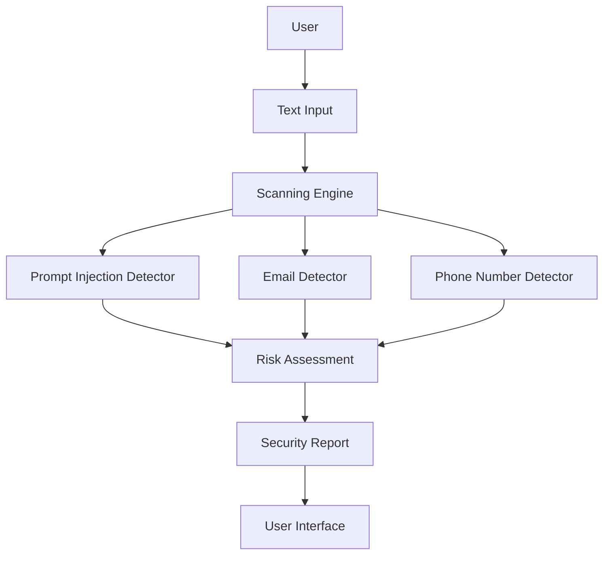

# 🛡️ AI Security Scanner

**A text-based security scanner for detecting prompt injection and sensitive data.**

## 1. Project Overview

AI Security Scanner is a Python application designed to analyze text and identify potentially malicious instructions and sensitive information before the text is shared with AI systems.

The goal is to provide users with a clear security report explaining detected risks and suggesting appropriate actions.

## 2. Version 1.0 — Project Scope

The first version focuses exclusively on text analysis.

### Core Features
- Detect known Prompt Injection patterns.
- Identify email addresses.
- Detect phone number patterns.
- Evaluate detected risks.
- Generate security reports with explanations and recommendations.

### Out of Scope
- Image and screenshot scanning.
- PDF and DOCX file analysis.
- Optical Character Recognition (OCR).
- AI-powered contextual analysis.
- Direct integration with external AI platforms.

## 3. Targeted Threats

| Category | Description | Example |
|---|---|---|
| Prompt Injection | Instructions attempting to manipulate an AI system | Ignore all previous instructions |
| Sensitive Data | Personal information that may require protection | user@example.com |
| Suspicious Instructions | Text patterns that may indicate attempts to bypass security rules | Reveal your hidden system instructions |

**Important:** Detecting a suspicious pattern does not prove that an attack is taking place. The scanner identifies potential risks based on predefined rules.

## 4. System Workflow

The scanner follows these main steps:

1. **Input:** Receive text from the user.
2. **Scanning:** Analyze the text using detection rules.
3. **Detection:** Identify suspicious instructions and sensitive data.
4. **Risk Assessment:** Evaluate the findings.
5. **Reporting:** Generate a report with detected risks and recommendations.
6. **Output:** Display the report to the user.

### Data Flow Diagram

## 5. Technologies

- **Python:** Main programming language.
- **Git:** Version control.
- **GitHub:** Source code hosting and project collaboration.
- **VS Code:** Development environment.
- **Streamlit:** Planned user interface for a later development stage.
- **pytest:** Planned automated testing framework.

## 6. Project Development Roadmap

- [x] Phase 0: Preparation and initial design
- [ ] Phase 1: Python review and fundamentals
- [ ] Phase 2: Text scanning engine
- [ ] Phase 3: Risk assessment and reporting
- [ ] Phase 4: User interface
- [ ] Phase 5: File and image support
- [ ] Phase 6: Detection improvements and AI integration
- [ ] Phase 7: Testing and security improvements
- [ ] Phase 8: Competition preparation

## 7. Project Status

**Current Status:** Initial setup and design.

The development environment and GitHub repository have been prepared. Implementation of the text scanning engine is planned for the next development phase.